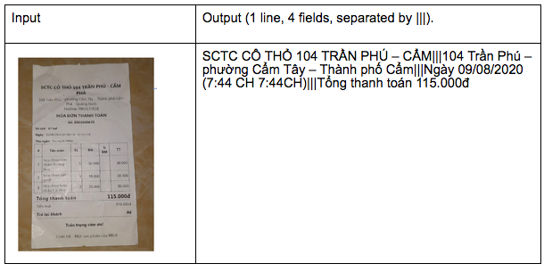
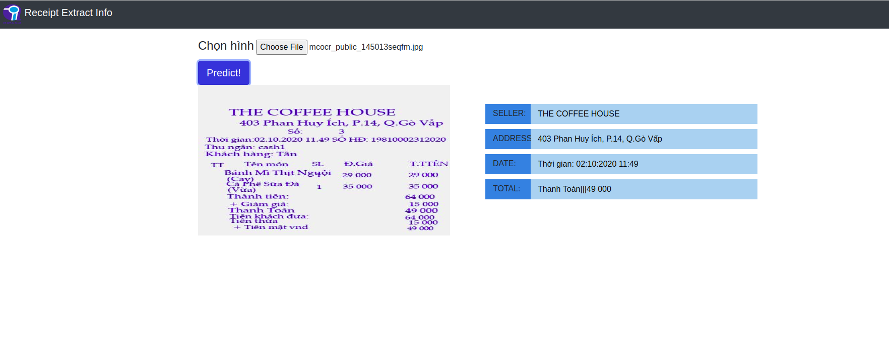

<h1>MC-OCR_RIVF2020 TASK 2</h1>

# Introduction

The challenge Task 2 of MC-OCR 2021 required extract information receipt. Extract texts of a number of key fields from given receipts. At maximum, a receipt image is associated with 4 fields annotated by human annotators. 4 fields (Fig below) contains: SELLER, ADDRESS, TIMESTAMP, TOTAL COST.

# RUN SUBMIT 
## COPY IMAGE_TEST
    `cp <folder_image_which_name_"input"> ./submit_task2`
## BUILD DOCKER COMPOSE
    `docker-compose up`
## OUTPUT 

A csv file will be created in the folder [output](https://gitlab.com/tiendv/mc-ocr_rivf2020/-/tree/full-task2-docker-compose/output)
Output image after preprocessing in folder [output_rotated_45](https://gitlab.com/tiendv/mc-ocr_rivf2020/-/tree/full-task2-docker-compose/output/output_rotated_45)

## WEB DEMO task 2
link web demo task 2: Information Extraction from Receipts: http://service.aiclub.cs.uit.edu.vn/receipt/

